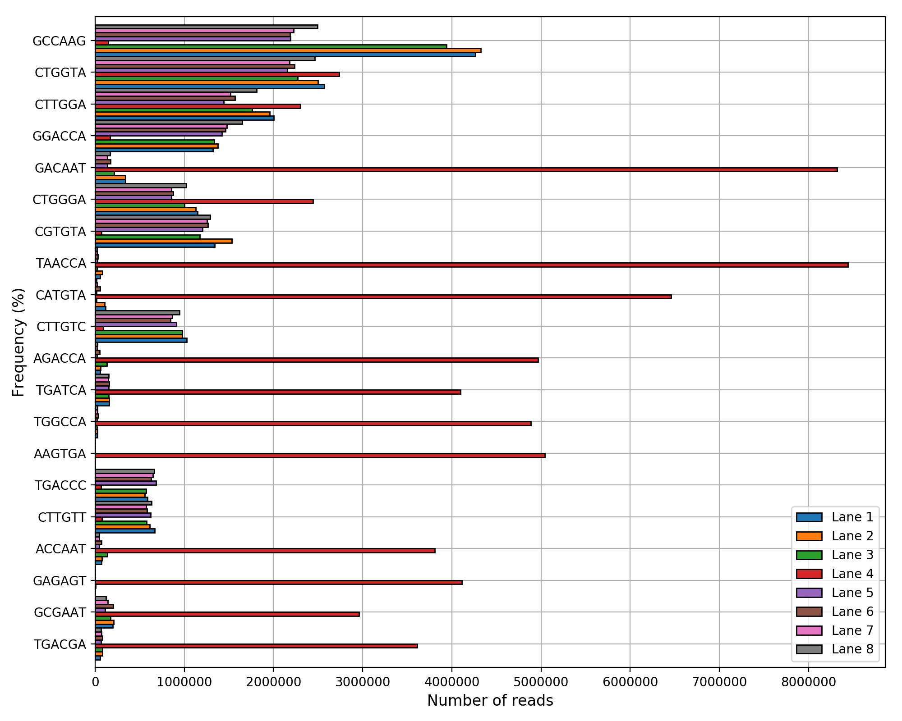
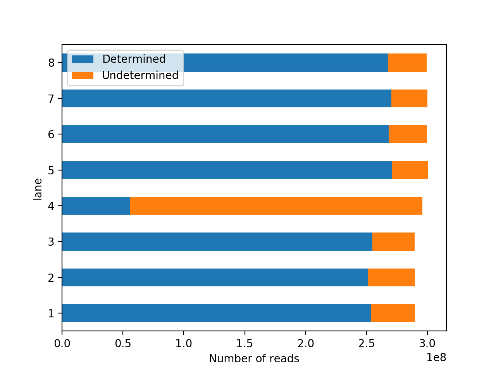
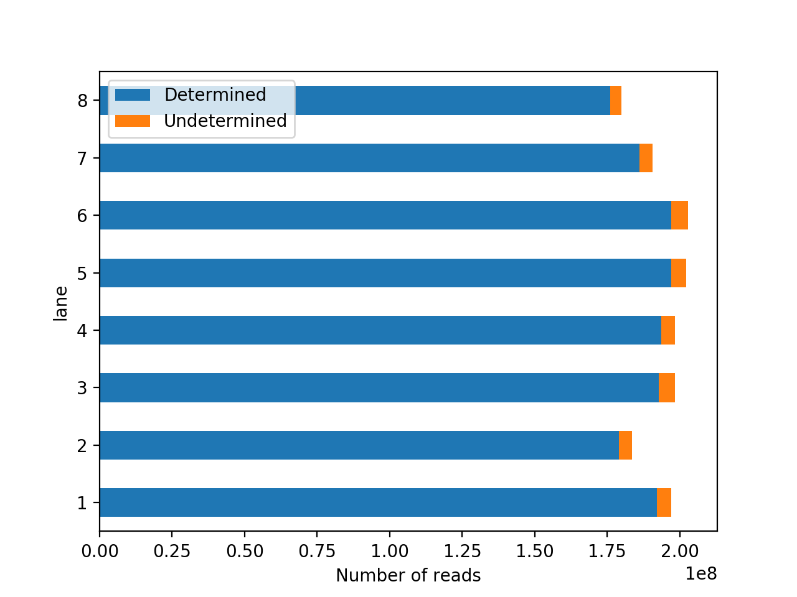

# Summary

**Sequana** is a Python-based software dedicated to the development of Next Generation Sequencing (NGS) pipelines.
We use the Snakemake [@snakemake:2012] framework to design our pipelines, which eases the decomposition of pipelines into modular sub-units. We currently have 7 pipelines covering quality control, variant calling, long-reads quality, de-novo and RNA-seq analysis (see https://sequana.readthedocs.io for details). Our pipelines are associated with HTML reports based on JINJA templating and Javascript. The reports are used to store the results of a pipelines but also materials required to reproduce the results. **Sequana** is also a Python library that provides tools to perform various analysis tasks (e.g., variant call filtering). Some of the library components provide original tools that are also available as standalone applications. For instance a fast taxonomic analysis based on Kraken [@kraken] as well as a tool to perform exhaustive coverage analysis [@coverage:2016] (bottom right panel in the image here below).

**Sequana** is an open source project (https://github.com/sequana/sequana). It is developed with the aim
of simplifying the development of new tools (for developers) and the deployment of the pipelines (for users).
The extended documentation (http://sequana.readthedocs.org) and test suite (on [Travis.org](http://travis-ci.org)) provide a high-quality
software that is routinely tested. **Sequana** is now available on bioconda making the installation easier and faster by taking care of the dependencies (e.g., samtools, bwa, or Python libraries).

Finally, for end-users, we also developed a Graphical interface called **Sequanix** [@sequanix:2017] developed with the PyQt framework (see left panel of the image here below). **Sequanix** standalone exposes all **Sequana** pipelines (Snakemake pipelines) within an easy-to-use interface. Within the graphical interface, the configuration file used by Snakemake are automatically loaded and can be edited by end-users with dedicated widgets. We made the interface generic enough that not only Sequana pipelines can be run interactively but also any Snakemake pipelines.

# Future works

**Sequana** is an on-going project. Although the project has reached a mature stage with stable pipelines, new pipelines will be including on demand or based on new technologies.

# References
