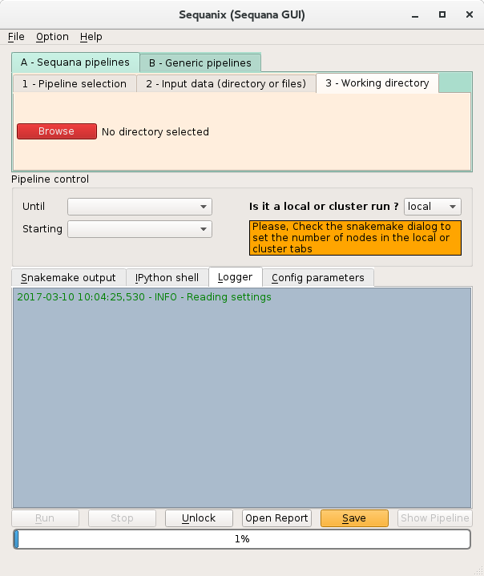

Sequanix
==========

This directory contains data and resources to demonstrate the usage of Sequanix.

Tutorial available on Sequana documentation web page http://sequana.readthedocs.io/en/master/sequanix.html

:Citations: 

In the reference above, the online supplementary illustrates the usage of Sequanix on 4 different cases:

- a sequana pipeline (quality control)
- a minimalist example (unix commands only) with a configuration file or without 
- a third-party example extracted from the Gene-regulation library.

All material and explanation for the the 2 first cases are available in the Sequana tutorial (linkj above) while the material for the Gene-regulation case are available on this dedicated page: `Gene regulation material <https://github.com/sequana/resources/tree/master/sequanix/gene_regulation.rst>`_
