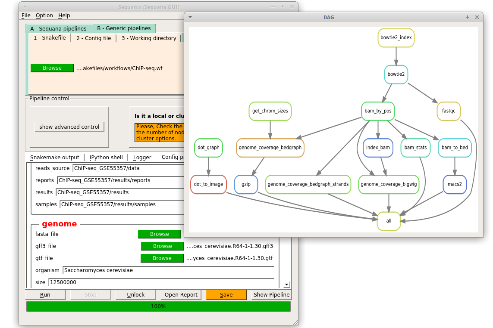

Gene regulation example
============================

This page shows how to load and execute a Snakemake pipeline from the **Gene-regulation** library (Rioualen et al, 2017) within the Sequanix application (Desvillechabrol et al, 2017). 
This tutorial is a snapshot (June 2017) of the official (and up-to-date) tutorial available on gene-regulation documentation web page http://gene-regulation.readthedocs.io/en/latest/tutorials.html

We will use one of the pipeline from the Gene-regulation library to demonstrate that **Sequanix** can load a third-party snakemake pipeline: here, the ChIP-seq pipeline. 

The ChIP-seq pipeline is part of the gene-regulation library, which needs to be installed. We also need to install **Sequana**. This pipeline requires some data to be copied in the the directory where will be installed the **Gene-regulation** library as well. 

Let us first define a directory.

Create an analysis and working directory
-------------------------------------------
::

    # Create a working and analysis directory at the top level
    export ANALYSIS_DIR=~/test_sequanix_gene-regulation
    mkdir ${ANALYSIS_DIR}
    cd ${ANALYSIS_DIR}

Download gene-regulation library
-------------------------------

::

    wget --no-clobber https://github.com/rioualen/gene-regulation/archive/4.0.tar.gz
    tar xvzf 4.0.tar.gz
    mv gene-regulation-4.0 gene-regulation

Install dependencies with Conda and Sequana
-----------------------------------------------

For information about conda and meaning of the following statements, please see the Installation instructions of Sequana on this page (http://sequana.readthedocs.io/en/master/installation.html#add-conda-channels). You need to add those channels once for all (in this order)::

    conda config --add channels conda-forge
    conda config --add channels defaults
    conda config --add channels r
    conda config --add channels bioconda

Then, to not interfere with your system, let us create a new conda environment from scratch::

    conda create --name genereg python=3.5
    source activate genereg

**Note:** when you open a new shell, the last instruction must be called

and install all dependencies including sequana itself::

    conda install -y fastqc bowtie2 bedtools samtools graphviz deeptools
    conda install -y r-essentials bioconductor-deseq2 bioconductor-edger
    conda install -y -c bioconda bioconductor-mosaics=2.10.0
    conda install -y sequana

For MACS2, note that only the version for Python2.7 is available (no Python 3 in June 2017). So, since we used conda for version 3 of Python, one need to trick the system using **pip2**, which is the **pip** version for Python2.7. Most distributions are still using Python2 so you should have the utility available. Type this command to install macs2 globally::

    pip2 install macs2

of if you do not have root permission::

    pip2 install --user macs2

For homer software, follow the instructions here : http://homer.ucsd.edu/homer/introduction/install.html 
Note that in June 2017 the following instructions are enough to install Homer on a unix box (you need perl)::

    wget http://homer.ucsd.edu/homer/configureHomer.pl
    perl configureHomer.pl -install
    export PATH=$PATH:$PWD/bin                # This should be added to you bashrc environment.

**Note:** when you open a new shell, the last instruction must be called (or set in a bashrc file)

**Warning** again note that the python version used for MACS2 is python 2.7

Download genomes and annotations 
-------------------------------------

Genome assembly: sacCer3::

    wget -nc ftp://ftp.ensemblgenomes.org/pub/fungi/release-30/fasta/saccharomyces_cerevisiae/dna/Saccharomyces_cerevisiae.R64-1-1.30.dna.genome.fa.gz -P ${ANALYSIS_DIR}/genome
    wget -nc ftp://ftp.ensemblgenomes.org/pub/fungi/release-30/gff3/saccharomyces_cerevisiae/Saccharomyces_cerevisiae.R64-1-1.30.gff3.gz -P ${ANALYSIS_DIR}/genome
    wget -nc ftp://ftp.ensemblgenomes.org/pub/fungi/release-30/gtf/saccharomyces_cerevisiae/Saccharomyces_cerevisiae.R64-1-1.30.gtf.gz -P ${ANALYSIS_DIR}/genome
    gunzip ${ANALYSIS_DIR}/genome/*.gz

Download ChIP-seq data
--------------------------

From GEO series `GSE55357 <https://www.ncbi.nlm.nih.gov/geo/query/acc.cgi?acc=GSE55357>`_::

    cd ${ANALYSIS_DIR}
    export URL="ftp://ftp.sra.ebi.ac.uk/vol1/fastq/SRR117/"
    wget --no-clobber ${URL}/005/SRR1176905/SRR1176905.fastq.gz -P fastq/GSM1334674&
    wget --no-clobber ${URL}/007/SRR1176907/SRR1176907.fastq.gz -P fastq/GSM1334676&
    wget --no-clobber ${URL}/008/SRR1176908/SRR1176908.fastq.gz -P fastq/GSM1334679&
    wget --no-clobber ${URL}/000/SRR1176910/SRR1176910.fastq.gz -P fastq/GSM1334677

    gunzip -c fastq/GSM1334674/SRR1176905.fastq.gz>fastq/GSM1334674/GSM1334674.fastq
    gunzip -c fastq/GSM1334676/SRR1176907.fastq.gz>fastq/GSM1334676/GSM1334676.fastq
    gunzip -c fastq/GSM1334679/SRR1176908.fastq.gz>fastq/GSM1334679/GSM1334679.fastq
    gunzip -c fastq/GSM1334677/SRR1176910.fastq.gz>fastq/GSM1334677/GSM1334677.fastq
    rm -f fastq/GSM133467?/SRR11769??.fastq.gz

**If you do not alter your bash, remember to do the following each time you open a new shell**::

    export ANALYSIS_DIR=~/test_sequanix_gene-regulation
    export PATH=$PATH:$PWD/bin
    source activate genereg
    cd $ANALYSIS_DIR
    
    
Run the workflow with sequanix
--------------------------------

You may watch the  `video (webm format)  <https://tinyurl.com/yajkodzn>`_ or follow those instructions:

Make sure you are in the ANALYSIS_DIR directory (see above) and start **Sequanix**. Then,  

#. At the top select the "Generic pipelines" tab
#. select the pipeline thanks to the browser, that is called gene-regulation/scripts/snakefiles/workflows/ChIP-seq.wf
#. select the config file in ./gene-regulation/examples/ChIP-seq_GSE55357/config.yml
#. set the working directory (the local directory where sequanix is launch, also referede to as ${ANALYSIS_DIR} above)
#. Press the "Save" button in the button
#. Press "Show pipeline" to check everything looks fine
#. Press "Run"
#. The analysis takes about 15-20 minutes

**Warning**: the output directory must contain the gene-regulation library.

<video width="800" height=600 controls="controls">
<source src="demo_genereg.webm"/> 
<source src="demo_genereg.ogg"/> 
test
</video>

